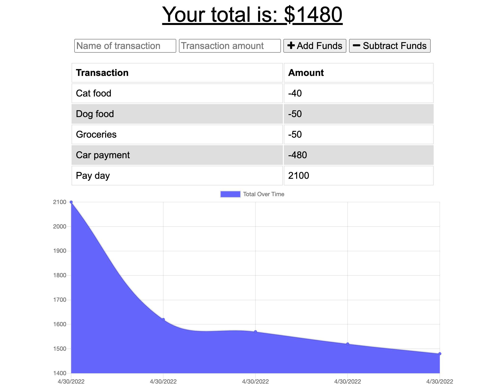

## Babes Budget Tracker
a budget tracking app, for babes!

### How it Works

The Babes Budget Tracker uses:

* node.js
* express.js
* indexedDB
* mongoose

### What it Does

keep tabs on your spending and bag-securing habits with this easy-to-use application. the babes budget tracker is a pwa that functions offline, meaning you can collect (and spend) your coin anywhere.

### How to Use it
simply deploy the app on heroku.

### Catch a Snap

